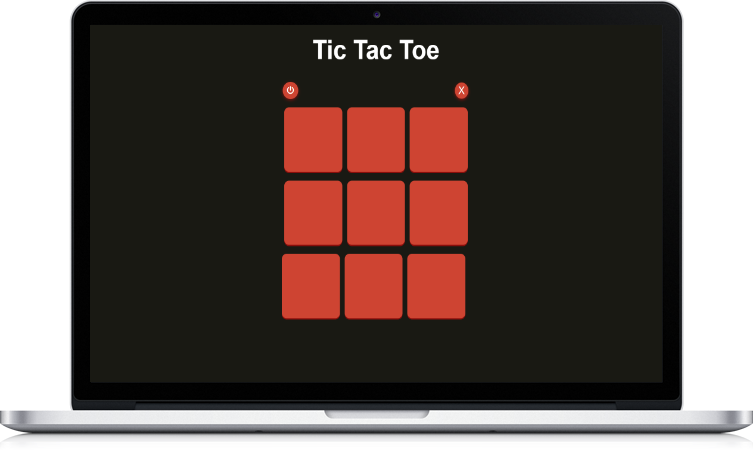

# Tic Tac Toe Game

## 🎮 About the Project

This is a simple Tic Tac Toe game built using HTML, CSS, and JavaScript. The game allows a player to compete against a computer, with a turn-based gameplay system and an interactive UI.

### ✨ Features

- Player vs Computer Mode

- Winning Line Display

- Dynamic Turn Indicator

- Game Reset & New Game Options

- Draw Detection

- Smooth UI with CSS Styling

### 🛠️ Technologies Used

- **HTML** - Structure of the game

- **CSS** - Styling and layout

- **JavaScript** - Game logic and interactivity

### 🚀 How to Play

- The game starts with Player X.

- Click on any empty box to make a move.

- The computer (O) will take its turn automatically.

- The game checks for a winner after each move.

- If a player wins, a winning line appears, followed by a message.

- If all boxes are filled without a winner, it's a draw.

- Click the Reset button to restart the game.

### 🖥️ How to Run the Game

- Download or clone this repository.

- Open the index.html file in any modern web browser.

- Start playing!

### 🔧 Future Improvements

Add a Player vs Player Mode.

Improve AI logic for better difficulty levels.

Add sound effects and animations.

#### Developed for the MARKH Developer Internship Program 🎯